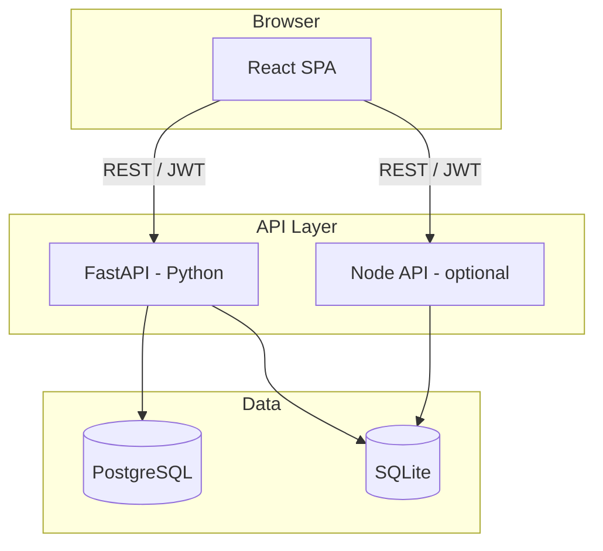

# Inventory & Order Management System

A full-stack, production-ready web application for managing products, customers, orders, and inventory with JWT authentication, role-based access, real-time stock validation, and Docker deployment support.

---

## Project Description

The **Inventory & Order Management System** helps businesses track stock levels, process customer orders, and generate operational reports. Staff and administrators can register publicly, manage catalog data, and enforce business rules such as preventing overselling and maintaining audit logs for every stock change.

---

## Project Overview

| Layer | Stack |
|-------|--------|
| Frontend | React 18, Vite, Tailwind CSS, React Router, Axios, Chart.js |
| Backend | FastAPI, SQLAlchemy, Pydantic, JWT (primary) |
| Alt API | Node.js + Express + sql.js (local dev without Python) |
| Database | PostgreSQL 16 (production) / SQLite (local) |
| DevOps | Docker, Docker Compose, Nginx |

---

## Features

- **Authentication** — Signup (username, email, password), login (username or email), JWT, protected routes, session persistence
- **Product management** — CRUD, search, filter, SKU uniqueness, images, featured catalog
- **Customer management** — CRUD, search, unique email
- **Order management** — Create, status updates, cancel, stock validation
- **Inventory** — Tracking, low-stock alerts, automatic logs on order/cancel
- **Reports** — Dashboard metrics, revenue, charts, top products
- **Public pages** — Home, catalog, About, Contact, Team, legal pages
- **UI** — Responsive layout, navbar, footer, hero, banner slider, statistics cards

---

## System Architecture



---

## Folder Structure

```
The-Ethara-AI-Project--Inventory-Order-Management-System/
├── frontend/          # React application
├── backend/           # FastAPI application
├── server/            # Node.js SQLite API (optional)
├── database/          # PostgreSQL reference schema
├── docs/              # Documentation
├── screenshots/       # Assessment screenshots
├── docker/            # Dockerfiles & nginx config
├── scripts/           # Verification scripts
├── docker-compose.yml
├── README.md
├── LICENSE
└── .env.example
```

See [docs/PROJECT_STRUCTURE.md](docs/PROJECT_STRUCTURE.md) for details.

---

## Database Schema

Six core tables: **Users**, **Products**, **Customers**, **Orders**, **OrderItems**, **InventoryLogs**.

Tables are created automatically on API startup. See [docs/DATABASE_SCHEMA.md](docs/DATABASE_SCHEMA.md).

---

## API Endpoints

| Module | Base Path |
|--------|-----------|
| Auth | `/api/auth/*` |
| Products | `/api/products/*` |
| Customers | `/api/customers/*` |
| Orders | `/api/orders/*` |
| Inventory | `/api/inventory/*` |
| Reports | `/api/reports/summary` |
| Health | `/health`, `/health/db` |

Full reference: [docs/API_DOCUMENTATION.md](docs/API_DOCUMENTATION.md) · Interactive docs: http://localhost:8000/docs (Python API)

---

## Authentication Flow

1. User submits signup (username, email, password) → password hashed (bcrypt) → user stored → JWT returned.
2. Login accepts **username or email** + password → JWT issued.
3. Frontend stores token in `localStorage` and sends `Authorization: Bearer <token>`.
4. Protected routes use `ProtectedRoute`; API validates JWT on each request.
5. Logout clears local storage.

---

## Inventory Management Flow

1. Products hold `quantity` (on-hand stock).
2. Creating an order validates each line item against available stock.
3. On success, stock is reduced and an **inventory_log** row is written.
4. Cancelling an order (non-completed) restores stock and logs the reversal.
5. Low-stock threshold (default 10) powers dashboard alerts.

---

## Order Processing Flow

1. Select customer and line items (product + quantity).
2. API validates customer exists and stock is sufficient.
3. Order + order_items created with status **Pending**.
4. Staff updates status (Processing → Completed) or cancels.
5. Cancel is blocked for **Completed** orders.

---

## Installation Guide

### Prerequisites

- Node.js 20+
- Python 3.12+ (optional)
- Docker Desktop (optional)
- Git

### Clone

```bash
git clone https://github.com/Sneha-Gaur/The-Ethara-AI-Project--Inventory-Order-Management-System.git
cd The-Ethara-AI-Project--Inventory-Order-Management-System
```

---

## Local Setup

### Quick start (recommended — no Python)

```bat
START_AUTH.bat
```

Open http://localhost:5173/signup

### Python backend

```bat
START.bat
```

### Manual

**Backend (Python):**

```bash
cd backend
python -m venv venv
venv\Scripts\activate    # Windows
pip install -r requirements.txt
cp .env.example .env
python init_database.py
uvicorn app.main:app --reload --host 127.0.0.1 --port 8000
```

**Backend (Node):**

```bash
cd server
npm install
npm run init-db
npm start
```

**Frontend:**

```bash
cd frontend
npm install
npm run dev
```

---

## Environment Variables

Copy `.env.example` to `.env` and `backend/.env.example` to `backend/.env`.  
See [docs/DEPLOYMENT_GUIDE.md](docs/DEPLOYMENT_GUIDE.md). **Do not commit secrets.**

---

## Docker Setup

Dockerfiles live in `docker/`:

- `docker/Dockerfile.backend` — Python 3.12 + FastAPI
- `docker/Dockerfile.frontend` — Node build + Nginx

### Docker Compose

```bash
cp .env.example .env
docker-compose up --build
```

| Service | URL |
|---------|-----|
| Frontend | http://localhost:3000 |
| Backend | http://localhost:8000 |
| PostgreSQL | localhost:5432 |

---

## Running Backend

| Mode | Command | Port |
|------|---------|------|
| Node (SQLite) | `cd server && npm start` | 8000 |
| Python | `cd backend && uvicorn app.main:app --reload` | 8000 |
| Docker | `docker-compose up backend` | 8000 |

---

## Running Frontend

| Mode | Command | URL |
|------|---------|-----|
| Dev | `cd frontend && npm run dev` | http://localhost:5173 |
| Docker | `docker-compose up frontend` | http://localhost:3000 |
| Production build | `npm run build` → serve `dist/` | — |

---

## Database Configuration

| Environment | `DATABASE_URL` | Notes |
|-------------|----------------|-------|
| Local (easy) | `sqlite:///./inventory.db` | File in `backend/` |
| Docker | `postgresql://postgres:...@db:5432/inventory_db` | Set in compose |
| Neon | `postgresql://...@neon.tech/...?sslmode=require` | Cloud Postgres |

`GET /health/db` confirms connection and table counts.

---

## Deployment

- **Frontend:** Vercel, Netlify — set `VITE_API_BASE_URL`
- **Backend:** Render, Railway — set `DATABASE_URL`, `JWT_SECRET`, `CORS_ORIGINS`
- **Database:** Neon PostgreSQL

Full guide: [docs/DEPLOYMENT_GUIDE.md](docs/DEPLOYMENT_GUIDE.md)

---

## Screenshots

Add images to `screenshots/` (see [screenshots/README.md](screenshots/README.md)):

| Page | File |
|------|------|
| Home | `01-home.png` |
| Login | `02-login.png` |
| Signup | `03-signup.png` |
| Dashboard | `04-dashboard.png` |
| Products | `05-products.png` |

---

## Testing

```bash
node scripts/verify.mjs
```

Manual checklist: [docs/TESTING_GUIDE.md](docs/TESTING_GUIDE.md)

---

## Demo Credentials

| Username | Email | Password |
|----------|-------|----------|
| admin | admin@inventory.com | admin123 |
| staffuser | staff@inventory.com | staff123 |

---

## Future Enhancements

- Email notifications for low stock
- PDF invoice export
- Multi-warehouse support
- Admin user management UI
- Refresh tokens and 2FA
- Automated CI/CD (GitHub Actions)

---

## Assessment Submission

Replace placeholders with your deployed links:

| Item | URL |
|------|-----|
| GitHub Repository | https://github.com/Sneha-Gaur/The-Ethara-AI-Project--Inventory-Order-Management-System |
| Backend Docker Hub Image | _(add after publishing image)_ |
| Frontend Hosted URL | _(add after Vercel/Netlify deploy)_ |
| Backend API Hosted URL | _(add after Render/Railway deploy)_ |

---

## Author Information

**Sneha Gaur**  
GitHub: [Sneha-Gaur](https://github.com/Sneha-Gaur)  
Repository: [The-Ethara-AI-Project--Inventory-Order-Management-System](https://github.com/Sneha-Gaur/The-Ethara-AI-Project--Inventory-Order-Management-System)

---

## License

This project is licensed under the [MIT License](LICENSE).

---

## Additional Documentation

- [API Documentation](docs/API_DOCUMENTATION.md)
- [Deployment Guide](docs/DEPLOYMENT_GUIDE.md)
- [Database Schema](docs/DATABASE_SCHEMA.md)
- [Project Structure](docs/PROJECT_STRUCTURE.md)
- [Testing Guide](docs/TESTING_GUIDE.md)
- [GitHub Push Instructions](docs/GITHUB_PUSH_INSTRUCTIONS.md)
